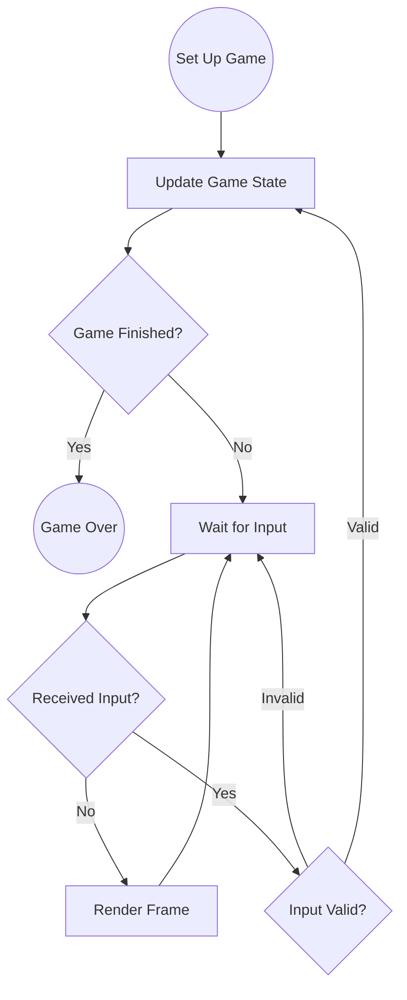

# Design Philosophy

In 2024, I was looking to learn `async` Rust and was finding it difficult to wrap my head around. I felt that I understood the concept of `async` functions as generators, but it was hard for me to see the whole picture. I did not fully understand how these resumable functions were supposed to be "driven to completion" (a phrase commonly used throughout the [official Rust book](https://rust-lang.github.io/async-book/) on `async` programming).

Around that time, I stumbled across a whitepaper demonstrating how to use coroutines as a tool to simplify writing large and complex state machines. After doing more research, I realized that, at their core, Rust `async` functions are stackless coroutines. It was from this realization that the idea for `posturn` emerged. Coroutines are by nature functions that can pause in the middle of execution to be resumed later. What if it were possible to use `async` Rust as not merely a tool for asynchronous multitasking, but as a way to simplify the process of writing games that follow this same pattern?

## Enter the turn-based game
Game developers who are used to writing e.g. first-person shooters tend to think of video games as real-time simulations. Such games are essentially in a perpetual "wait-for-input" state&mdash;an infinite loop in which the game processes input events from the OS, updates its state, and then re-renders itself. While this design lends itself well to real-time games, it makes assumptions that are not particularly helpful when writing a turn-based game.

Turn-based games follow a very different pattern:

Notice that contrary to a real-time game, the turn-based game **only** transitions to a new state when we are _not_ waiting for input. This wait-for-input state can take many forms, e.g. waiting for an animation to finish playing or waiting for a player to take his or her turn. The majority of the time, the game is simply polling for input and rendering itself, but the game does **not** update its internal state until valid input is received. If input is received, this triggers the next state transition. If input is **not** received, the game simply returns to rendering itself.