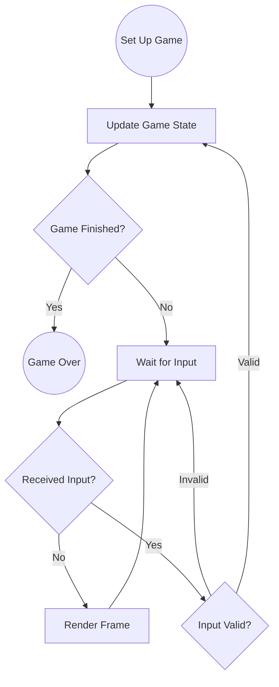

# Enter the turn-based game
Game developers who are used to writing e.g. first-person shooters tend to think of video games as real-time simulations. Such games are essentially in a perpetual "wait-for-input" state&mdash;an infinite loop in which the game processes input events from the OS, updates its state, and then re-renders itself. While this design lends itself well to real-time games, it makes assumptions that are not particularly helpful when writing a turn-based game.

Turn-based games follow a very different pattern:

Notice that contrary to a real-time game, the turn-based game **only** transitions to a new state when we are _not_ waiting for input. This wait-for-input state can take many forms, e.g. waiting for an animation to finish playing or waiting for a player to take his or her turn. The majority of the time, the game is simply polling for input and rendering itself, but the game does **not** update its internal state until valid input is received. If input is received, this triggers the next state transition. If input is **not** received, the game simply returns to rendering itself.