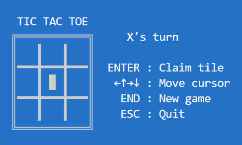

<!--
SPDX-FileCopyrightText: 2024 Andrew T. Christensen <andrew@andrewtc.com>

SPDX-License-Identifier: CC-BY-SA-4.0
-->

# `tui` example
This example demonstrates how to build a full terminal-based `TicTacToe` game using `posturn` and `crossterm`.



All code in this example is divided into three files:
 - [`game.rs`](game.rs): Defines logic for running the turn-based game (`TicTacToe`), but not for displaying it
 - [`view.rs`](view.rs): Contains purely [TUI](https://en.wikipedia.org/wiki/Text-based_user_interface) logic for displaying and processing input for the `TicTacToe` game (`View`)
 - [`main.rs`](main.rs): The `main` application, which passes execution between the `Host` and the `View` during play

The goal is to maintain a clean separation between all game logic (`TicTacToe`) and UI logic (`View`). This is an area
in which `posturn` really excels!

## Running the example
To run the example:
1. Open a command prompt
2. Navigate to the `posturn` root
3. Run the following command:
   ```ps1
   cargo run --example tui
   ```

## Controls
|Key|Function|
|:--|:--|
|`ENTER`|Claim a tile on the game board, or start a new game|
|Arrow keys|Move the cursor|
|`ESC`|Quit|